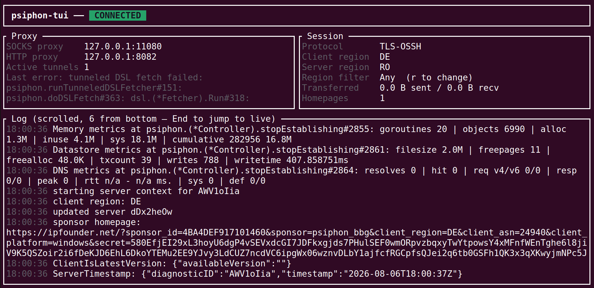

# psiphon-tui



A **Rust** TUI (built with [ratatui](https://ratatui.rs)) for the [psiphon-tunnel-core](https://github.com/Psiphon-Labs/psiphon-tunnel-core) engine, driven by the exact command-line shape this project was built around:

```
psiphon -config psiphon.config -serverList server-list-standard.txt -dataRootDirectory data
```

## Architecture

```
┌────────────────────┐   FFI (cgo)   ┌────────────────────────────────┐
│  Rust TUI (ratatui) │◄─────────────►│ libpsiphon_bridge.so (Go)      │
│  src/*.rs           │  poll notices │ psiphon-core/RustBridge        │
└────────────────────┘               │   ↓ uses                       │
                                      │ github.com/Psiphon-Labs/       │
                                      │ psiphon-tunnel-core/psiphon    │
                                      │ (vendored, unmodified)         │
                                      └────────────────────────────────┘
```

- **`psiphon-core/`** — the complete, unmodified Psiphon source, vendored from commit
  [`a70e0b58`](https://github.com/Psiphon-Labs/psiphon-tunnel-core/commit/a70e0b58c68377dcdfd7b081c0054bf9c2aae1c8)
  (see `VENDOR_COMMIT`).
- **`psiphon-core/RustBridge/bridge.go`** — the only new file added to the source: a cgo shim built with
  `go build -buildmode=c-shared` into `libpsiphon_bridge.so`. Unlike the stock `ClientLibrary` (which blocks
  for the whole connection attempt and never surfaces notices), this bridge:
  - starts the tunnel asynchronously (`PsiphonStart` returns quickly, not once connected),
  - streams every Psiphon notice (the same JSON events Android/iOS/ConsoleClient clients produce) into a
    queue that Rust drains with `PsiphonPollNotice` — so the TUI shows live connection status instead of a
    single final result.
- **`src/`** — the Rust crate:
  - `ffi.rs` — raw `extern "C"` bindings
  - `psiphon.rs` — safe wrapper + background poller thread
  - `notice.rs` — parsing/human-readable rendering of notice JSON
  - `app.rs` — connection-state machine
  - `cli.rs` — argument parser (`-config` / `-serverList` / `-dataRootDirectory`, matching upstream
    ConsoleClient's own flags)
  - `ui.rs` / `main.rs` — ratatui rendering and the event loop
- **`build.rs`** — runs `go build` on the bridge before the Rust build, copies the `.so` next to the final
  binary, and sets an rpath so `LD_LIBRARY_PATH` isn't required.

## Requirements

- Go ≥ 1.26 (required by the upstream `go.mod`; if not installed, the toolchain is downloaded automatically
  — see "Restricted networks" below)
- Rust/Cargo (edition 2021)
- Tested and confirmed on Linux (output: `libpsiphon_bridge.so`)

### Restricted networks (GOPROXY)

If `proxy.golang.org` / `dl.google.com` aren't reachable (they weren't in this project's sandbox), use a
mirror:

```bash
export GOPROXY=https://goproxy.cn,direct
export GOSUMDB=sum.golang.org
```

`build.rs` sets this value by default unless you've already set `GOPROXY` yourself.

## Build & run

```bash
cargo build --release
./target/release/psiphon \
  -config psiphon.config \
  -serverList server-list-standard.txt \
  -dataRootDirectory data
```

(`cargo run --release -- -config ... -serverList ... -dataRootDirectory ...` works too.)

All three flags are also optional — if omitted, they default to `./psiphon.config`, `./server-list-standard.txt`,
and `./data` in the current directory (the first two only if that file actually exists there), so plain
`./target/release/psiphon` works once those files are in place.

The first time you run `cargo build`, `build.rs` compiles the bridge itself (~20-30s, mostly downloading the
Go toolchain if needed). Later builds are fast unless `bridge.go` changed.

## ⚠️ Important: real config and server list

This project runs the **real** Psiphon engine, but it cannot generate confidential values like
`PropagationChannelId`, `SponsorId`, or a real server list (`TargetServerEntry`) for you — these are assigned
by Psiphon Inc. per deployment and aren't available in the public source.

You have two options:

1. **Use your own real `psiphon.config`** (e.g. extracted from an official Android/Windows Psiphon build you
   have access to) and point `-config` at it.
2. **Stand up your own throwaway test server** (fully local, for development/testing):

   ```bash
   cd psiphon-core/Server
   go build -o psiphond .
   ./psiphond -ipaddress 127.0.0.1 -protocol OSSH:9999 generate
   # server-entry.dat and *.config are generated; put server-entry.dat's
   # contents in the client config's TargetServerEntry field (or pass it via -serverList)
   ./psiphond run &
   ```

   Full details in `psiphon-core/README.md`, "Generate configuration data" section.

`psiphon.config.example` and `server-list-standard.txt.example` at the project root are just structural
samples (with `FFFFFFFFFFFFFFFF` placeholders) — without real values the app still comes up and shows live
notices, but never connects to anything (this behavior is tested and expected).

## TUI keybindings

| Key | Action |
|---|---|
| `s` | Start / reconnect (when idle/stopped/error) |
| `x` | Disconnect without quitting |
| `r` | Open the region (country) picker |
| `q` / `Esc` | Quit (graceful shutdown) |
| `Ctrl+C` | Quit (graceful shutdown) — raw mode disables the tty's normal Ctrl+C→SIGINT behavior, so this is handled explicitly |
| `↑`/`k`, `↓`/`j` | Scroll the log (or move through the region list when the `r` panel is open) |
| `PgUp`/`PgDn` | Scroll faster |
| `End` | Jump to the live end of the log |
| `Enter` (in the `r` panel) | Apply the selected region and auto-reconnect |
| `Esc` (in the `r` panel) | Close the panel without changing anything |

On launch, the app immediately attempts to connect (like the original CLI) — no need to press `s` first.

Even if the terminal itself is killed (window closed, SSH session dropped, `kill`/`SIGTERM`), a background
signal watcher stops the tunnel and releases the datastore lock rather than leaving an orphaned process.

### Region selection

Pressing `r` opens a panel listing only the countries Psiphon itself has reported through the real
`AvailableEgressRegions` notice — i.e. only regions that actually exist among the server entries your client
(from `-serverList` or prior connections) has. The list is never hardcoded or guessed. Until you've
successfully pulled in entries from at least one region, only "Any" is shown.

Selecting a region and pressing `Enter`:
- If the tunnel was running, it's stopped automatically first; once shutdown is confirmed, it reconnects with
  the new `EgressRegion` filter (`state: Stopping → Stopped → Starting`, no need to press `s`).
- If it was already stopped, it immediately attempts to connect with the new filter.

Country codes (`US`, `DE`, ...) are shown with full country names (`United States`, `Germany`, ...) via
`src/regions.rs` — that file is purely cosmetic, not the source of what's selectable.

## Headless testing

There's also a headless diagnostic tool that exercises the same FFI path and prints the notice stream
(useful for debugging a real config before running the full TUI):

```bash
cargo run --example smoke -- psiphon.config server-list-standard.txt data 15
```

## What the TUI panels show

- **Proxy**: local SOCKS/HTTP proxy ports (from the `ListeningSocksProxyPort`/`ListeningHttpProxyPort`
  notices), active tunnel count (`Tunnels`), and the most recent error (if any) — shown dimly if the tunnel is
  otherwise healthy, in red only when the connection has actually failed.
- **Session**: active tunnel protocol (`ActiveTunnel`), client/server region, traffic volume
  (`TotalBytesTransferred`), sponsor homepage count.
- **Log**: a live stream of every notice, colored by severity (error/warning/info).

## Improving DPI resistance (protocol selection)

If the default protocol (often raw OSSH) is being detected/blocked on your network, first find out what your
actual servers support — don't guess. Each line of `server-list-standard.txt` is one hex-encoded server
entry; using Psiphon's own package (`psiphon-core/psiphon/common/protocol`, `NewStreamingServerEntryDecoder` +
`(*ServerEntry).SupportsProtocol`) you can count how many servers support each protocol: `OSSH`, `TLS-OSSH`,
`UNFRONTED-MEEK-HTTPS-OSSH`, `UNFRONTED-MEEK-SESSION-TICKET-OSSH`, `FRONTED-MEEK-*` (CDN fronting, e.g. via
Cloudflare — you may well have zero servers supporting this), and `INPROXY-WEBRTC-OSSH` (the newest and
hardest to detect — looks like real video-call traffic).

Notable things found in practice:

- Unrecognized keys in the JSON config are **silently ignored** (`psiphon.LoadConfig` uses plain
  `json.Unmarshal`, not a strict decoder) — a small typo in a field name produces no error, it just does
  nothing. Before trusting a config field, confirm the exact name exists in `psiphon-core/psiphon/config.go`.
- `INPROXY-WEBRTC-OSSH` (the WebRTC protocol) needs "broker specs", which only reach the client via
  **Tactics** (Psiphon's own remote-tuning system); with `"DisableTactics": true`, this protocol is
  effectively always rejected even when servers support it (see the
  `"inproxy client: no broker specs and tactics disabled"` message in `psiphon-core/psiphon/controller.go`).
- To prefer stealthier protocols without getting permanently stuck on them if none connect, use
  `InitialLimitTunnelProtocols` + `InitialLimitTunnelProtocolsCandidateCount` — it restricts only the first N
  candidates to these protocols, after which `LimitTunnelProtocols` (left empty/unrestricted) applies:

  ```json
  {
    "InitialLimitTunnelProtocols": [
      "INPROXY-WEBRTC-OSSH",
      "UNFRONTED-MEEK-SESSION-TICKET-OSSH",
      "UNFRONTED-MEEK-HTTPS-OSSH",
      "TLS-OSSH"
    ],
    "InitialLimitTunnelProtocolsCandidateCount": 50
  }
  ```

  This exact setup was tested end-to-end against a real 391-server list: it connected in ~2 seconds with
  `ActiveTunnel` reporting `TLS-OSSH` (instead of raw OSSH).

## License

The vendored code in `psiphon-core` is GPLv3 (see that directory) from Psiphon Inc. This project's
Rust/bridge code should likewise be considered GPLv3, since it links directly against it.
